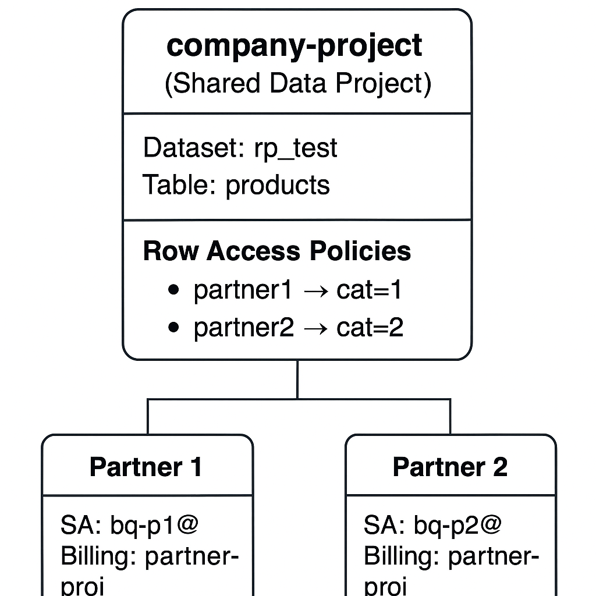

# 🔐 BigQuery Row-Level Security for Partner Data Access (Terraform + GCP CLI)

This project demonstrates how to securely share **BigQuery data with multiple partners** so that:

- Each partner can see **only the rows relevant to them**, using **Row Access Policies (RLS)**.
- Each partner’s queries are **billed to their own billing project**, not yours.
- The entire setup — IAM, datasets, and access policies — is **automated with Terraform** and a **Makefile**.

---

## 🏢 Scenario

A company manages analytics data in Google Cloud and wants to provide each of its partners controlled access to a shared BigQuery dataset.

- **Dataset location:** `europe-west1`
- **Company project:** `company-project`
- **Partner billing project:** `partner-project`
- **Goal:** Partner A can see only `Category = 1` rows, Partner B only `Category = 2`, and each partner’s queries are billed to their own billing project.

This example automates:
1. Creating partner-specific service accounts
2. Building the BigQuery dataset and table
3. Loading sample data
4. Applying row-level access control
5. Verifying that each partner’s queries are billed correctly

---

## 🧱 Architecture Overview
 

